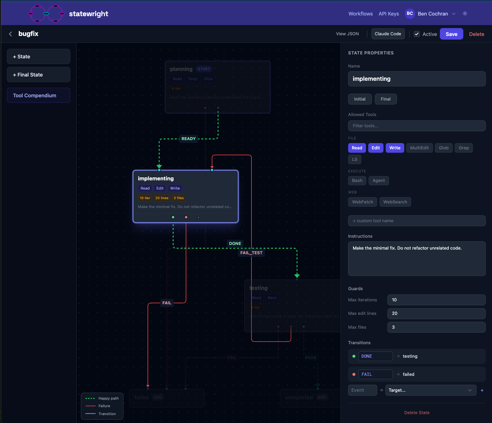

# statewright

> Agents are suggestions, states are laws.

State machine guardrails that control which tools your AI agent can use in each phase. Define a workflow once, enforce it across Claude Code, Codex, Cursor, opencode, and Pi. [Full docs →](https://docs.statewright.ai)

> **Statewright Plugin 0.3.0 for Claude and Codex is released:** model routing now works natively in both TUIs. Assign a model, reasoning level, tool policy, and budget to each workflow phase while staying in the interface you already use. [Learn more at statewright.ai →](https://statewright.ai)



## The problem

AI agents are brittle. Give a model 40+ tools and an open-ended problem and it re-reads the same file five times, calls Edit during review, deploys before tests pass. The common fix is bigger models and longer prompts... it helps sometimes. Observability tells you what went wrong after the fact; it doesn't prevent it.

## The approach

Instead of making the model bigger, make the problem smaller.

State machines constrain the tool and solution spaces so the model reasons in a focused context at each step. A planning state gets read-only tools. When the agent transitions to implementation, edit tools unlock with limited shell access. Write-via-redirect and destructive ops are still blocked even when Bash is allowed. Testing only permits designated test commands.

Call a tool that's not in the current phase and you get rejected with a message telling you what IS available and how to transition. State machines loop and retry (unlike DAGs), which is what agentic work actually needs.

Works on frontier and local models alike. Below 13GB, models can produce tool calls but can't retain enough file content to make accurate edits. Above that threshold, the guardrails start turning failures into completions.

## Quickstart

<details open>
<summary><strong>Codex</strong></summary>

```
npx statewright-codex@latest init
```
</details>

<details>
<summary><strong>Claude Code</strong></summary>

```
/plugin marketplace add statewright/statewright
/plugin install statewright
```
</details>

<details>
<summary><strong>opencode</strong></summary>

```
npx statewright-opencode@latest init
```
</details>

<details>
<summary><strong>Cursor</strong></summary>

```
npx statewright-cursor@latest init
```
</details>

Your browser opens → sign up at [statewright.ai](https://statewright.ai) → generate a key → paste it → done.

Then start a workflow:

```
❯ start the bugfix workflow — fix the failing tests in calc.py

◆ statewright — statewright_start (workflow: bugfix)
◆ [statewright] Workflow activated: bugfix

◆ statewright — statewright_get_state (MCP)

◆ Current phase: planning. Let me read the code first.

  Read 2 files

  [statewright] planning => implementing

◆ statewright — statewright_transition (READY)

  Edit calc.py: 1 line changed

  [statewright] implementing => testing

◆ statewright — statewright_transition (DONE)

  Bash: pytest -x — 7 passed

  [statewright] testing => completed
◆ [statewright] Workflow complete. 46 seconds.
```

You can also use the slash command directly: `/statewright start bugfix`.

## Research results

In our 5-task SWE-bench subset (not the full 2294-instance benchmark), two local models **went from 2 of 10 attempts passing to 10 of 10** with statewright constraints. Same tasks, same hardware.

| Model | Size | Bug Fix (26 lines) | SWE-bench (5 tasks) |
|-------|------|--------------------|---------------------|
| gemma3 | 3.3GB | FAIL | FAIL |
| gemma4:e2b | 7.2GB | PASS* | FAIL |
| gpt-oss:20b | 13.8GB | PASS | PASS (5/5) |
| gemma4:31b | 19.9GB | PASS | PASS (5/5) |
| llama3.3 | 42.5GB | PASS | PASS (2/2)† |

*\*with specialized edit_line tool adaptation*
*†tested on 2 of the 5 tasks (added after initial experiment run)*

The floor is around 13GB. Below that, models identify bugs correctly but can't serialize surgical edits (they rewrite entire files). That's a model limitation, not ours.

The structural win on larger models is breaking read-loop death spirals and keeping the tool space small enough that the model reasons instead of flailing. [Research brief →](https://statewright.ai/research)

## How it works

### Architecture

Three layers, each independently useful:

1. **Engine** (`crates/engine`) — Pure Rust state machine evaluator. States, transitions, guards, tool restrictions. Deterministic. No LLM in the loop. No runtime dependencies.

2. **Agent binary** (`crates/cli`, binary: `sw-agent`) — Direct-to-Ollama agent executor. Loads a workflow, runs the LLM in a constrained loop, enforces tool access, and streams structured JSONL events. Supports per-state model routing via `--config`, and single-state execution via `--state` (the TUI or MCP gateway orchestrates, `sw-agent` executes one state at a time and exits).

3. **Executor and plugin layer** (`plugins/executor` + `crates/mcp-gateway` + `plugins/`) — One executor owns the workflow session, credentials, isolated delivery, telemetry, and host lifecycle. Thin host adapters translate native tool hooks and model-routing controls for Pi, Claude Code, OpenCode, Cursor, and OMX. Codex uses the same delivery core through its app-server adapter. The `statewright_run_agent` MCP tool remains available for states that benefit from direct Ollama execution.

The TUI (`crates/tui`, binary: `statewright`) is a ratatui terminal interface that spawns `sw-agent` as a subprocess and renders its JSONL event stream in real time. It handles keyboard input, demo mode, and fixture selection.

### Per-state model routing

States can specify which model to use via the `model` field. A `default_model` in `meta` applies to states without an explicit override. The executor uses the strongest deterministic boundary each host exposes: Pi and OpenCode switch live, Claude Code and Cursor resume the same session after a route change, OMX applies the route at startup, and the Codex app-server adapter routes each turn.

```json
{
  "meta": { "default_model": "claude-sonnet-4-20250514" },
  "states": {
    "diagnose": {
      "model": "claude-haiku-4-5-20251001",
      "allowed_tools": ["Read", "Bash"]
    },
    "propose_fix": {
      "model": "anthropic/claude-opus-4-6",
      "allowed_tools": ["Read"]
    },
    "execute": {
      "allowed_tools": ["Read", "Edit", "Bash"]
    }
  }
}
```

In this example, `diagnose` uses Haiku (fast, cheap reconnaissance), `propose_fix` escalates to Opus (high-stakes reasoning), and `execute` inherits the `default_model` (Sonnet). The `sw-agent` binary also accepts a `--config` file with a `model_routing` block for per-state Ollama URL, temperature, and context window overrides.

### Guardrails

| Guardrail | What it does |
|-----------|-------------|
| Per-state tool enforcement | Agent can't see or call tools outside `allowed_tools` for the current state |
| Bash discernment | Blocks `echo > file`, `rm -rf`, `sed -i`, and scripting interpreters (`python`, `node`) when Write/Edit aren't allowed. Even if Bash itself is permitted. |
| Edit guards | Rejects diffs exceeding `max_edit_lines`, caps files edited per state |
| Command allow-lists | Only prefix-matched commands run (e.g. `pytest`, `cargo test`) |
| Conditional transitions | Programmatic guards on context data: `test_result eq pass`, `coverage gt 80` |
| Approval gates | `requires_approval` pauses for human review |

### Approval routing

Mark a transition with `requires_approval: true` to park it for review. The
gateway defaults to local UI routing and stores the pending approval (including
its `approval_message`) in the session state cache. Client hooks surface that
message as a review prompt after the transition; they do not block the host's
Stop hook.

Set `meta.approval_mode` to `"external"` when an out-of-band reviewer owns the
decision. In that mode clients leave the pending approval to that channel and
do not present a local prompt. Statewright does not currently ship a Telegram,
Slack, or Discord dispatcher; an external integration must resolve the pending
approval through the gateway callback/API.

Codex, OMX, and Claude Code hooks refresh their cached workflow state after a
transition. When that cache contains a pending local approval, those hooks
PostToolUse hook asks the host UI to present the review message. Their Stop
hooks deliberately pass through: they must not hide or replace the host's
approval prompt. An `external` approval mode leaves that prompt to the
configured integration instead.
| Interrupts | Edit a file matching a glob pattern? Auto-transition to a validation state, then return where you were |
| Fork/join | Run branches sequentially or in parallel, join when all (or any) complete |
| Environment scoping | Hide `PROD_DB_URL` via `blocked_env`, substitute with `env_overrides` |
| Session isolation | Per-session state via `CLAUDE_SESSION_ID` |
| Per-state model routing | Route cheap states to small models, expensive states to frontier models. `model` per state, `default_model` in `meta`. |
| Thinking level control | Per-state `thinking_level` field (`high`, `medium`, `low`, `off`) for clients that support reasoning effort tuning. |
| Tool escalation detection | Validator warns when a state jumps 2+ privilege levels without an approval gate |

Full guardrail reference in [the docs](https://docs.statewright.ai/tools/reference).

## Define your own workflows

```json
{
  "id": "bugfix",
  "initial": "planning",
  "meta": {
    "default_model": "claude-sonnet-4-20250514"
  },
  "states": {
    "planning": {
      "allowed_tools": ["Read", "Grep", "Glob"],
      "model": "claude-haiku-4-5-20251001",
      "thinking_level": "low",
      "max_iterations": 8,
      "on": { "READY": "implementing" }
    },
    "implementing": {
      "allowed_tools": ["Read", "Edit", "Write"],
      "max_edit_lines": 20,
      "max_files_per_state": 3,
      "on": { "DONE": "testing" }
    },
    "testing": {
      "allowed_tools": ["Read", "Bash"],
      "allowed_commands": ["pytest", "cargo test", "npm test"],
      "on": {
        "PASS": { "target": "completed", "guard": "tests_passed" },
        "FAIL_TEST": "implementing"
      }
    },
    "completed": { "type": "final" }
  },
  "guards": {
    "tests_passed": { "field": "test_result", "op": "eq", "value": "pass" }
  }
}
```

Point your agent at the [JSON schema](https://statewright.ai/workflow-schema.json) and it generates a workflow via `statewright_create_workflow`. Tweak tools, commands, and environment blocks in the [visual editor](https://statewright.ai/workflows).

## Supported agents

**Hard** enforcement means tool calls are intercepted before execution. **Live**, **resume**, and **startup** describe when a host can apply a state model route. The managed `codex` and `claude` shims provide transparent terminal routing after a one-time opt-in; each boundary resumes the managed CLI process, so it is not a hot swap inside an existing model turn. Launch other hosts through [`statewright-exec`](plugins/executor/) when the workflow requires isolated delivery or executor-owned routing.

| Agent | Release line | Executor integration | Tool enforcement | Route boundary |
|-------|--------------|----------------------|------------------|----------------|
| [Claude Code](plugins/claude-code/) | 0.3.0 candidate | Hooks + executor MCP bridge | Hard | Managed restart with forked session |
| [Codex](plugins/codex/) | 0.3.0 candidate | App-server hooks + shared executor bridge | Hard | Managed restart of the same thread |
| [Oh My Codex](plugins/omx/) | 0.1.x | Native hooks + executor MCP bridge | Hard | Startup |
| [Pi](plugins/pi/) | 0.2.0 | Native extension + executor MCP bridge | Hard* | Live |
| [OpenCode](plugins/opencode/) | 0.2.0 | Native plugin + executor MCP bridge | Hard | Live |
| [Cursor](plugins/cursor/) | 0.2.0 | Native hooks + executor MCP bridge | Hard in executor mode | Resume same chat |

*\*Pi includes tool name normalization and tool-call recovery for local models (Ollama, LM Studio).*

### Isolated delivery

The shared executor can create clean multi-repository worktrees before a task
starts, then run project-owned Taskfile hooks for preview preparation,
deployment, validation, promotion, and cleanup. Codex and the other executor
hosts use the same pinned delivery core. Statewright limits the hook environment
and binds deploy and validation evidence to the exact source fingerprint. See the
[isolated delivery guide](plugins/codex/docs/isolated-delivery.md).

### MCP tools

The gateway exposes these tools to the connected agent:

| Tool | Purpose |
|------|---------|
| `statewright_load_workflow` | Activate a named workflow, optionally resuming a paused run |
| `statewright_get_state` | Current state, allowed tools, transitions, iteration count, model, thinking level |
| `statewright_transition` | Emit an event to advance the state machine |
| `statewright_list_workflows` | List available workflows and which is active |
| `statewright_create_workflow` | Create a new workflow from a JSON definition |
| `statewright_pause` | Pause the current run; resume later with `load_workflow(resume=true)` |
| `statewright_deactivate` | Turn off enforcement; all tools pass through |
| `statewright_get_status` | Gateway health: active workflow, state, available workflows |
| `statewright_run_agent` | Spawn the Rust agent executor (`sw-agent`) for direct-to-Ollama bug fixing |
| `statewright_force_state` | Jump to any state bypassing guards (debug mode only, gated on `meta.debug`) |

## Pricing

The managed cloud at [statewright.ai](https://statewright.ai) handles workflow storage, run history, and the MCP gateway. Prices won't go up.

| Plan | Workflows | Transitions/mo | Run History | Price |
|------|-----------|-------------|----------------|-------|
| Free | 3 | 200 | 72 hours | $0 |
| Pro | 10 | 2500 | 7 days | $19/mo |
| Team | 30 | 10000 | 90 days | $99/mo |
| Enterprise | Unlimited | Unlimited | to Specification | [Contact us](mailto:sales@statewright.ai) |

## Self-hosting

Run the full stack locally with Docker Compose — PocketBase, MCP gateway, and workflow editor. BYO Ollama. [Self-hosted guide →](https://docs.statewright.ai/getting-started/self-hosted)

```bash
cd self-hosted && docker compose up --build
```

The engine (`crates/engine`) and agent layer (`crates/agent`) are Apache 2.0, embeddable with no runtime dependencies. The MCP gateway is FSL-1.1-ALv2 (converts to Apache 2.0 in 2029). Single-developer and single-team self-hosting is permitted under the FSL license.

## Tradeoffs

- Requires MCP support in the agent (or hooks for non-MCP agents like Codex)
- Workflow definitions are authored by hand, though agents can generate them via `statewright_create_workflow`
- Standalone Cursor MCP/rules mode remains advisory. `statewright-exec --host cursor` uses Cursor hooks for hard enforcement and resumes the same chat across route changes.
- Research results are from a 5-task SWE-bench subset, not the full 2294-instance benchmark
- If a workflow is too restrictive, the agent gets stuck. `statewright_deactivate` is the escape hatch

## Docs

[docs.statewright.ai](https://docs.statewright.ai) — install guide, workflow authoring, [schema reference](https://docs.statewright.ai/workflows/schema-reference), [MCP tool reference](https://docs.statewright.ai/tools/reference), [agent-generated workflows](https://docs.statewright.ai/tools/agent-generated-workflows), and [isolated delivery](https://docs.statewright.ai/features/isolated-delivery/).

## Contributing

Workflow definitions, templates, and bug reports welcome. See [Create Your Own](https://docs.statewright.ai/workflows/create-your-own/) for how to write workflows.

- [Report an issue](https://github.com/statewright/statewright/issues/new)
- [Discussions & feedback](https://github.com/statewright/statewright/discussions)

## License

Apache 2.0 — portions [FSL-1.1-ALv2](https://fsl.software) (converts to Apache 2.0 on May 3, 2029). Managed cloud at [statewright.ai](https://statewright.ai).

This project includes a [patent pledge](./PATENTS.md) covering independent implementations of the techniques described in the patent. Solo developers, researchers, open source projects, and single-team self-hosted deployments are covered regardless of whether they use Statewright software.

> One hook to rule them all.


