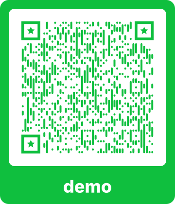

# AI Agents at Work

<center>
<b>From clever prompts to guarded workflows</b>
<br><br>

Ben Cochran

<small>June 2026<br>Xtern AI Summit<br>Techpoint/IndyHackers</small>

</center>

Note: Open with the frame: this is not a hype talk. It is about getting useful work out of AI systems when real code, data, and security constraints are involved.

---

## About Me

<div style="display:grid; grid-template-columns:0.9fr 0.9fr 1.2fr; gap:22px; align-items:start;">
<div style="text-align:center;"></div>
<div style="font-size:0.74em;">

- Indy Hackers Board Member & Vice President
- 20+ years Full Stack Engineering
- Former NVIDIA/AMD Distinguished Engineer, AI & ML
- Now building Statewright.ai

</div>
<div style="text-align:center;"><br></div>
</div>

Note: Keep this short. Mention Indy Hackers as makers, not movie hackers, but keep the running gag alive.

---

## Who This Is For

- Software Engineers building features
- Data Scientists turning noise into signal
- Cyber Security Personnel triaging too much input
- Anyone asked to use AI at work

Note: Xterns are already embedded in real companies. That matters because the standard consumer AI story breaks down once you have repos, tests, incidents, and organizational risk.

---

## The Practical Question

> How do we make AI useful when mistakes matter?

Not someday.

Right now.  This summer.  On your teams.

Note: Keep this grounded in internship reality. The audience does not need a philosophy of intelligence. They need a way to use tools without creating chaos.

---

## The Default AI Flow

1. Paste a task
2. Hope the model understands
3. Accept a patch
4. Discover what broke later

That is not an engineering process.

An agent chat window is not a software delivery system.

Note: The issue is not that models are useless. The issue is that an unconstrained chat window is not a software delivery system.

---

## Agents Change the Shape

An agent can:

- Read files
- Search code
- Edit files
- Run tests
- Call APIs

Useful and dangerous all at the same time.

Note: The leap from chatbot to agent is tool use. Once a model can act, the problem becomes less like writing and more like operations.

---

## Claude, Codex, Cursor, Pi

Different surfaces. Same pattern.

```txt
model + context + tools + feedback loop
```

The tool boundary is where control lives.

Note: Avoid product tribalism. The names differ, but the architecture is similar enough that the workshop lessons transfer.

---

## Agentic Engineering

Vibe coding is riding the wave of what the AI chooses to give you.

Agentic Engineering is harnessing AI to fulfill requirements reliably, consistently.

---

## Skills

Skills package expertise:

- When to use a workflow
- What files to inspect
- Which commands to run
- How to judge completion

They make good behavior reusable.

They are subject to model reasoning and context starvation, however.

Note: A skill is not magic. It is a small operating manual the agent can load at the right time.

---

## Hooks

Hooks sit around tool calls.

```txt
before tool -> allow or block
after tool  -> inspect result
```

This turns policy into code.

Note: Pre-tool hooks can prevent dangerous or premature actions. Post-tool hooks can record results, detect changes, and trigger workflow transitions.

---

## Prompting Is Not Enough

Prompts are instructions.

Skills are instruction manuals.

Tools are capabilities.

Hooks are validators.

Note: The model can rationalize around a prompt. It cannot call a tool that is not present, or that a hook rejects.

---

## Statewright

> Agents are suggestions. States are laws.

Each phase gets:

- Tools
- Commands
- Iteration budget
- Model/Thinking
- Environment restrictions
- Exit transitions

Note: Introduce Statewright as an enforcement layer, not as another model. It narrows what the agent can do at each point in the work.

---

## Read Before Edit

```
planning:
  tools: Read, Grep, Glob

implementing:
  tools: Read, Edit, Write
```

The agent cannot skip ahead.

Note: This is the first practical lesson. Force investigation before mutation. It is simple, but it removes a large class of agent mistakes.

---

## Test Before Done

```
testing:
  tools: Read, Bash
  commands: npm test
```

Passing tests become the gate.

You can use a guard to enforce tests pass before proceeding to the next phase.

Note: Testing is where the agent receives objective feedback. If tests fail, the workflow loops back to implementation.

---

## Better AI Results

Good agent tasks have:

- A concrete spec
- Scoped file changes
- Executable tests
- Clear stop conditions
- Guarded tool access

Note: This is the checklist they can take back to their internships. AI works better when the task is engineered.

---

## AI, ala carte

Statewright lets you:

- Define a specific model for a given phase
  - Plan with a frontier model, Implement with a local/mini model
- Step budgets
- Loop until completed (within reason)
- Restrict tools
- Restrict Environment Variables
    - (e.g. can't utilize production ENV vars)
- Capture an Audit Trail

---

## What We're Building

Security teams get a firehose.

We will build an incident signal dashboard.

```txt
events -> ETL -> API -> Vue dashboard
```

Note: This connects all three tracks: software, data, and cyber. The app is intentionally small, but the shape is real.

---

## Data Aspects

Raw events are messy:

- Different vendors
- Mixed field names
- Severity drift
- Duplicate activity

The job is signal extraction.

Note: This is the data science angle. The important part is not a pretty chart; it is turning noisy events into useful summaries.

---

## Security Aspects

An alert is not an incident.

An incident needs:

- Severity
- Affected entity
- Evidence
- Next action

Note: This keeps the cyber side honest. We are not just listing logs; we are producing something an analyst could act on.

---

## Software Aspects

The dashboard needs contracts:

```txt
/api/summary
/api/incidents
/api/timeline
```

Frontend and backend agree there.

Note: The API boundary is the engineering contract. Tests should verify it independently from the UI.

---

## Workshop Flow

1. Read the spec
2. Start the workflow
3. Run the tests
4. Fix the pipeline
5. Improve the dashboard

Note: Encourage attendees to keep their own ideas, but make the tests green first. Open-ended improvements come after the baseline works.

---

## Suggested Agent Prompt

```
Use Statewright. Read spec.md first.
Make npm test pass.
Then improve the Vue dashboard.
```

This is intentionally plain.  The workflow has micro prompting at each phase.

Less is more.

Guardrails do the pacing.

Note: This is deliberately plain. A good workflow should not require a thousand-word prompt.

---

## What To Watch

- Does it read before editing?
- Does it run tests?
- Does it loop on failures?
- Does it explain transitions?

The workflow should keep the agent on task and block at appropriate times.

Note: The goal is not merely that the model writes code. The goal is to see whether the harness keeps the agent in a sane SDLC.

---

## Takeaways

AI helps when work is shaped for it.

- Specs beat vibes
- Tests beat opinions
- Hooks beat reminders
- Workflows beat one-shot prompts

Note: Close the talk portion here and move into the live workshop.

---

## Workshop

<div style="display:flex; gap:28px; align-items:flex-start;"><div style="width:42%; text-align:center;"></div><div style="flex:1; font-size:0.78em; padding-top:46px;">

Please support Statewright:
* Star
* Follow
* Tell a friend
* Tell your org

</div></div>

```bash
git clone https://github.com/statewright/statewright
cd statewright/docs/outreach/techpoint-xtern-june-2026
npm run demo
```

Note: The QR opens the outreach folder. The TUI does not need npm install; it uses built-in Node modules. Playwright e2e is the only path that needs npm install.
